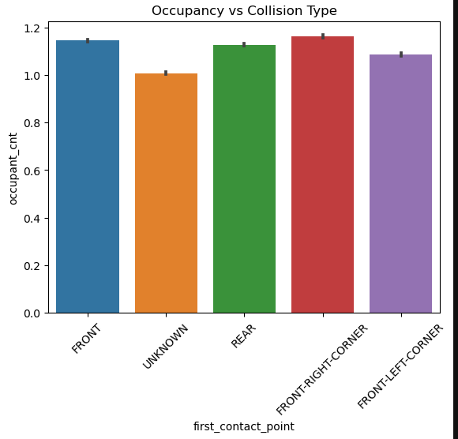

## A Data-Driven Insights on Predicting Cause of Crash Outcomes in Chicago 

## Introduction
The project successfully developed a multi-class classification model to predict crash collision patterns using vehicle characteristics, occupancy data, and driving behavior indicators.

Despite the absence of direct accident cause labels, the analysis demonstrates that meaningful insights into crash dynamics can be derived from available vehicle-level data. The Random Forest model proved effective in capturing complex relationships within the data and provided reliable predictions across multiple collision categories.

The findings highlight the importance of integrating vehicle, human, and behavioral factors when analyzing traffic accidents, reinforcing the value of data-driven approaches in improving road safety outcomes.

## Business Understanding

## Problem Statement
The goal of this project is to build a multi-class classification model that predicts the **first point of contact in a crash**, using features related to:
- Vehicle characteristics
- Occupancy levels
- Driving behavior
  

## Business Value
- Enables proactive accident prevention  
- Supports data-driven policy decisions  
- Improves allocation of safety resources
  
* Data Understanding

The dataset used is the **Traffic Crashes Vehicles dataset**, which contains detailed information about vehicles involved in crashes.

## Key Variables
- vehicle_type (type of vehicle involved ) 
- num_passengers (number of passengers)  
- occupant_cnt (total occupants)  
- maneuver(vehicle action before crash)  
- first_contact_point (collision type)- target variable  

## Data Suitability
This dataset is suitable because it captures:
- Mechanical factors (vehicle type)  
- Human factors (occupancy)  
- Behavioral factors (maneuver)

## Data Preparation — Cleaning

To ensure data quality and reliability:
- Duplicate records were removed  
- Column names were standardized for consistency  
- Columns with excessive missing values (>50%) were dropped  

## Missing Value Handling
- Categorical variables - filled with "Unknown"  
- Numerical variables - filled with median values

## Key Insights from EDA

- Front-end collisions are the most common
   
- Turning maneuvers are strongly linked to side collisions
  
- Vehicle type influences how collisions occur where the passanger vehicles had most of the crashes
 
- Occupancy levels show moderate variation across crash types

## Data Preparation — Preprocessing

## Encoding Strategy

- Low-cardinality categorical variables ( One-hot encoding)   
- Identifier columns (dropped the crash_record_id) 

## Justification
This approach prevents Overfitting 
* Random Forest

Random Forest was selected as the primary model because:
It captures non-linear relationships  
It handles interactions between variables  
It performs well on structured data

* Evaluation 

The following metrics were used:
Precision  
Recall  
F1-score  
 Confusion Matrix  

In this context:
- False negatives  (missed identification of risky crash patterns ) 
- False positives ( inefficient allocation of safety resources)  

Therefore, **F1-score was prioritized** as it balances precision and recall, ensuring both types of errors are minimized.

The model demonstrates that:
- Crash dynamics can be predicted using vehicle and behavioral data  
- Driving behavior is a strong indicator of collision patterns  
- Data-driven approaches can support proactive safety interventions

## Recommendation
Based on the findings of this analysis, the following recommendations are proposed:

1. **Enhance Driver Behavior Interventions**
   - Focus on high-risk maneuvers such as turning and sudden stopping

2. **Vehicle-Specific Safety Policies**
   - Introduce stricter safety standards for high-risk vehicle categories
   - Encourage adoption of advanced safety features such as collision avoidance systems

3. **Occupancy-Based Safety Measures**
   - Promote seatbelt compliance and passenger safety awareness
   - Strengthen enforcement of occupancy-related regulations
## Conclusion
The project successfully developed a multi-class classification model to predict crash collision patterns using vehicle characteristics, occupancy data, and driving behavior indicators.

Despite the absence of direct accident cause labels, the analysis demonstrates that meaningful insights into crash dynamics can be derived from available vehicle-level data. The Random Forest model proved effective in capturing complex relationships within the data and provided reliable predictions across multiple collision categories.

The findings highlight the importance of integrating vehicle, human, and behavioral factors when analyzing traffic accidents, reinforcing the value of data-driven approaches in improving road safety outcomes.# Data-Driven-Insights-on-Predicting-Cause-of-Crash-Outcomes-in-Chicago
